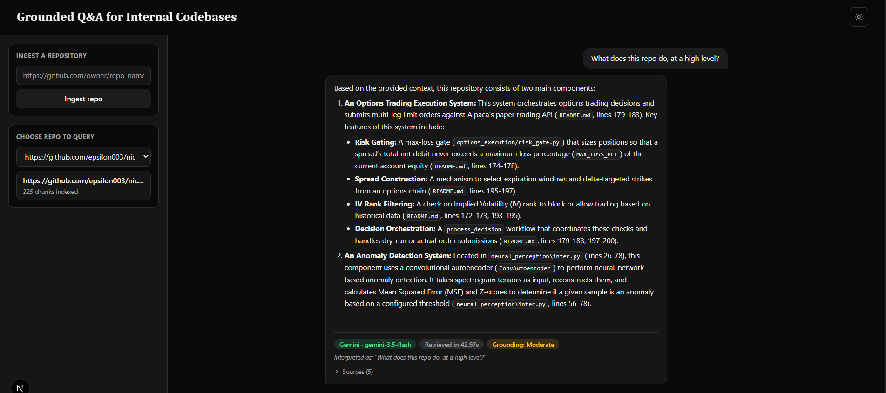

# Grounded Q&A System for Internal Codebases (RAG)

Ask natural-language questions about a public GitHub repository and get streamed, grounded answers with clickable citations back to the exact lines they came from.

**FastAPI + Next.js** (`api/` + `frontend/`) — the production path: a real REST/SSE API backend with a modern React frontend. Both work off the same shared `rag_core/` business logic, ensuring zero duplication and easy maintenance.


## Stack

| Component | Choice | Why |
| --- | --- | --- |
| **Chunking** | `tree-sitter` (AST-aware) + LangChain fallback | Splits on actual syntax boundaries (functions, classes) for ~40+ languages, preventing awkward mid-function cuts. Lockfiles are excluded entirely. |
| **Embeddings** | `sentence-transformers` (Configurable) | Runs 100% locally. Defaults to `BAAI/bge-small-en-v1.5` (~130MB), but easily swappable via `.env` to code-specific models like `jinaai/jina-embeddings-v2-base-code`. Lazy-imported to avoid blocking UI startup. |
| **Vector Store** | ChromaDB (Local + Singleton) | Embedded, zero-infra, free. Process-level singleton avoids re-paying `PersistentClient`'s warmup cost on every question. |
| **Retrieval** | **Hybrid Search** (Vector + BM25 RRF) | Pure semantic search misses exact identifier matches (e.g., `verify_token`). We pair Chroma with `rank-bm25` and use Reciprocal Rank Fusion (RRF) to merge both result sets for maximum recall. |
| **Reranking** | Local cross-encoder (`ms-marco-MiniLM-L-6-v2`) | Precision pass on the top-k pool before generation; also feeds the groundedness confidence indicator. |
| **Generation** | Google AI Studio (Gemini) + OpenRouter fallback | Free tier, no card required. Auto-router self-heals as OpenRouter's free lineup changes. |
| **Backend API** | FastAPI + SSE Streaming | REST + Server-Sent Events for real-time ingestion progress and chat token streaming. |
| **Frontend** | Next.js (App Router, TypeScript, Tailwind v4) | Dark mode, markdown rendering, stop/retry, collapsible citations, and responsive design. |

## Features

### Answering & Retrieval
- **Hybrid Search (Vector + BM25)**: Combines semantic understanding with exact keyword matching using Reciprocal Rank Fusion (RRF), fixing the #1 gap in code retrieval.
- **Multi-Query Expansion**: Automatically generates 2 alternative phrasings of the user's query to catch vocabulary mismatches before merging and reranking results.
- **Metadata Filtering**: Scope queries to specific directories or file types (e.g., exclude `test/`, restrict to `.py`) via native ChromaDB `where` filters.
- **Streamed Answers**: Token-by-token generation with a streaming-safe Markdown renderer that auto-closes incomplete syntax mid-stream.
- **Follow-up Handling**: Rewrites contextual questions (e.g., *"what about its error handling?"*) into standalone queries using recent chat history.
- **Retrieval Routing**: Greetings and meta-questions skip retrieval and the LLM entirely, saving API calls and preventing awkward "nothing found" responses.

### Citations & Grounding
- **Source Citations**: Expandable code previews with GitHub permalinks (`.../blob/<commit-sha>/path#L12-L20`) that stay valid even if the repo's default branch moves.
- **Groundedness Indicator**: A heuristic "Strong / Moderate / Weak" badge derived from the reranker's *relative margin* scores, giving an honest visual cue for answer reliability (see math below).
- **Multi-Provider Resilience**: Gemini → optional pinned OpenRouter model → OpenRouter auto-router, with retry-with-backoff on transient errors (429/503).

### Next.js UI Specifically
- Dark mode (persisted, respects system preference).
- "Thinking" indicator with rotating status text during retrieval.
- Loading screen while checking backend connectivity; distinct "can't reach server" screen with retry if the backend is down.
- `Ctrl`/`Cmd`+`K` focuses the question input.
- Collapsible sources list (collapsed by default to keep the chat clean).
- Toast Notifications

## Setup and Installation

### 1. Backend (FastAPI)
From the project root:
```bash
python3 -m venv venv
source venv/bin/activate  # On Windows: venv\Scripts\activate
pip install -r requirements.txt
cp .env.example .env
```
Edit `.env` to add your free API keys. *(Optional but recommended for Windows users: add `HF_HOME=D:\huggingface_cache` to prevent C: drive space issues during model downloads).*

Start the backend:
```bash
uvicorn api.main:app --reload --port 8000
```
Check it's alive at `http://localhost:8000/docs` (interactive Swagger UI).

### 2. Frontend (Next.js)
From the `frontend/` directory:
```bash
cd frontend
npm install
npm run dev
```
Opens at `http://localhost:3000`. It talks to the backend at `localhost:8000` by default.

> **Free-tier model IDs rotate.** If you get a 404 like "no longer available", the pinned model name in `.env` is stale. Check [Google AI Studio](https://ai.google.dev/gemini-api/docs/models) and [OpenRouter](https://openrouter.ai/models?order=pricing-low-to-high) and update there. No code changes needed.

## Usage
1. Paste a public GitHub repo URL into the sidebar and click **Ingest repo**.
2. Select the ingested repo from the dropdown.
3. Ask a question. Follow-ups automatically resolve pronouns/context (shown as "Interpreted as: ..." when rewritten).
4. The answer streams in with a provider badge, a groundedness badge, and an expandable **Sources** list linking to exact GitHub commit lines.

*Note: Re-running ingestion on the same repo will instantly skip if the `commit_sha` hasn't changed, saving time and compute.*

## Grounding Score: The Math

The confidence badge (Strong / Moderate / Weak) is a heuristic, not a calibrated probability. It is explicitly designed to handle the domain mismatch of code vs. natural language.

**The Formula** (`rag_core/retrieval.py::_compute_confidence`):
1. Fetch `top_k_retrieve = 15` candidates, rerank all 15, keep top `top_k_final = 5` as cited chunks.
2. `top_avg` = mean(rerank_score for the 5 cited chunks)
3. `baseline` = mean(rerank_score for the 10 discarded chunks)
4. `margin` = `top_avg` − `baseline`
5. `confidence` = `1 / (1 + e^(−margin))` *(sigmoid, maps margin to 0–1)*

**Why relative, not absolute?** The cross-encoder (`ms-marco-MiniLM`) was trained on web search prose, not code. Its absolute scores for code run systematically lower. Comparing the top 5 against the bottom 10 *from the same retrieval call* sidesteps this: "meaningfully better than what got discarded" is a comparison against itself, not a number tuned for a different domain.

**Calibration:** The `0.75` / `0.50` cutoffs are starting points. Use `python -m rag_core.eval` with a small golden dataset of your own Q&A pairs to tune these boundaries for your specific use cases.

## Testing

### Unit tests (Python)
```bash
pip install -r requirements-dev.txt
pytest
```
Covers chunking (file filtering, line-number resolution), the prompt-injection sanitizer, the repo-URL-to-collection-name slug, and the eval harness's own metric logic (hit-rate, MRR) via a stubbed retriever — no live vector store or model downloads required.

### Retrieval eval harness (`rag_core/eval_harness.py`)
Different from `rag_core/eval.py` (which calibrates the confidence *thresholds* on a couple of examples): this measures whether retrieval itself is any good — a change to chunking, embeddings, or reranking can quietly make context worse without anything crashing, and this is what catches that.

```bash
# Requires the gaude repo itself to already be ingested (ingest.py or the UI),
# since eval/golden_dataset.json evaluates the pipeline against its own source.
python -m rag_core.eval_harness

# Point at a different dataset / top-k, or wire into CI:
python -m rag_core.eval_harness --dataset eval/golden_dataset.json --top-k 3
python -m rag_core.eval_harness --json report.json
python -m rag_core.eval_harness --fail-under 0.8   # exit 1 if hit-rate drops below 80%
```
Reports hit-rate@k, MRR, and a per-query pass/fail with expected-vs-retrieved files.

### E2E tests (frontend)
```bash
cd frontend
npm install
npx playwright install --with-deps chromium   # one-time browser download
npm run test:e2e
```
Mocks the backend's `/api/repos` response via `page.route()`, so it exercises the connected/unreachable UI states without needing a live `uvicorn` process.

## Project Structure

```text
.
├── .env.example              # Copy to .env and fill in API keys
├── requirements.txt
├── requirements-dev.txt      # pytest, for `pytest` / rag_core/eval_harness.py tests
├── eval/
│   └── golden_dataset.json   # Questions + expected source files, for rag_core/eval_harness.py
├── tests/                    # pytest unit tests (chunking, sanitization, eval harness)
├── api/                      # FastAPI backend
│   ├── main.py               # Endpoints: health, repos, ingest (+SSE), chat (SSE)
│   ├── jobs.py                # In-memory background ingestion job tracking
│   └── schemas.py             # Pydantic request models
├── frontend/                 # Next.js UI
│   ├── app/                   # Layout, page, global styles
│   ├── components/            # Sidebar, ChatPanel, MarkdownMessage, Badges, etc.
│   ├── lib/                   # api.ts (typed client + SSE parsing)
│   └── tests/e2e/              # Playwright E2E specs (npm run test:e2e)
└── rag_core/                 # Shared business logic (used by BOTH api/ and CLI)
    ├── chunking.py            # AST-aware (tree-sitter) splitting with LangChain fallback
    ├── embeddings.py           # Local sentence-transformers wrapper (lazy-imported)
    ├── vector_store.py         # ChromaDB wrapper: Hybrid search (BM25+RRF), metadata filtering
    ├── reranker.py             # Local cross-encoder reranking (lazy-imported)
    ├── llm_client.py           # Gemini + OpenRouter clients: streaming, retry/failover, follow-up condensing
    ├── sanitization.py         # Prompt-injection defense for retrieved context
    ├── ingestion.py            # Orchestrates clone -> chunk -> embed -> store (with SHA skip logic)
    ├── retrieval.py            # Orchestrates routing -> multi-query expand -> retrieve -> rerank -> generate
    ├── eval.py                 # Standalone script to calibrate confidence thresholds (`python -m rag_core.eval`)
    └── eval_harness.py         # Retrieval quality eval: hit-rate/MRR against eval/golden_dataset.json
```

## Scope

**In scope:** Public repo ingestion, AST-aware chunking (with lockfile exclusion), local embeddings, **hybrid semantic + BM25 retrieval**, multi-query expansion, metadata filtering, streamed grounded answer generation, file/line citations with GitHub permalinks, follow-up handling, retrieval routing, groundedness indicator, multi-provider failover, stop/retry, dark mode.

**Out of scope:** Private repos, multiple repos queried simultaneously, control/data-flow analysis, code generation/modification, full diff-based incremental re-ingestion (current implementation skips redundant ingests but does a safe rebuild if the SHA changes), conversation history persistence (each session is in-memory only).

## Pro-Tips & Troubleshooting
- **Windows Disk Space**: Hugging Face caches models to `C:\Users\...\.cache` by default. If you get a "Not enough free disk space" warning, add `HF_HOME=D:\huggingface_cache` (or any drive with space) to your `.env` file, or set it as a system environment variable *before* starting the server.
- **First Run Latency**: The first time you ask a question or ingest a repo, `sentence-transformers` and the cross-encoder will download and load into memory. This takes ~10-30 seconds. Subsequent interactions are near-instant due to lazy-loading and process-level singletons.
